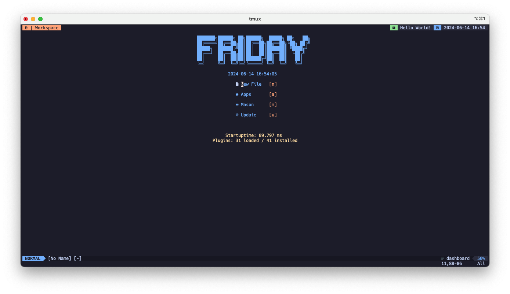

# Neovim Configuration Readme

This repository contains my personal Neovim configuration, tailored to my
preferences and workflow. Below is a brief overview of key features and how to
set it up.

This config is heavily influenced by [kickstart](https://github.com/nvim-lua/kickstart.nvim.git)

## Features

### **Plugins**: Utilizes popular plugins to enhance Neovim's functionality, including:
  - aerial: a code outline window for skimming and quick navigation
  - colorscheme-catppuccin: a soothing pastel color scheme for enhanced visual experience
  - conform: a formatting solution to get consistent code styles
  - dab: debug Adapter Protocol client implementation for Neovim
  - dashboard: a customizable dashboard for Neovim for quick access to projects and files
  - fterm: a floating terminal plugin for an integrated terminal experience within Neovim
  - gitignore: a plugin to manage .gitignore files efficiently
  - gitsigns: git integration for Neovim to show git change signs and perform git actions
  - indent-blankline: a plugin to display indentation levels with thin vertical lines
  - leap: an advanced navigation plugin for jumping to any location in the text efficiently
  - lualine: a responsive statusline written in Lua with a variety of configurations
  - mini: a minimal and fast collection of Lua modules for Neovim
  - nvim-cmp: a completion plugin for Neovim to provide intelligent autocompletion
  - nvim-lspconfig: ease setting up language servers for Neovim’s built-in LSP client
  - nvim-scrollbar: a customizable scrollbar plugin for Neovim
  - nvim-tree: a file explorer tree for navigating and managing files from within Neovim
  - nvim-treesitter: a better syntax highlighting and code parsing using Tree-sitter
  - oil: an improved file explorer as a buffer in Neovim
  - rainbow_csv: a highlighter for CSV and TSV files to enhance readability
  - sayonara: a plugin to quickly close buffers and delete files
  - telescope: an extensible fuzzy finder over lists for Neovim
  - todo-comments: highlight and manage TODO comments within your code
  - undotree: a visual undotree for better understanding of undo history
  - which-key: a keybinding helper for discovering key mappings in Neovim

### **Mappings**: Custom key mappings to streamline common tasks and improve productivity.
| Description                                              | Mapping                     |
|----------------------------------------------------------|-----------------------------|
| Word [S]u[g]gestion                                      | <leader>sg                  |
| [S][p]ell check toggle                                   | <leader>sp                  |
| [C]lear search                                           | :noh<CR>                    |
| [g][l]ow                                                 | <Cmd>Glow<CR>               |
| [L]azy [G]it                                             | <Cmd>Lazygit<CR>            |
| Debug: Set Breakpoint                                    | <leader>B                   |
| Debug: Toggle [b]reakpoint                               | <leader>b                   |
| Nvim[T]ree Toggle                                        | <leader>T                   |
| Update `MiniSurround.config.n_lines`                     | <leader>msn                 |
| Highlight surrounding                                    | <leader>msh                 |
| Find left surrounding                                    | <leader>msF                 |
| Find right surrounding                                   | <leader>msf                 |
| Replace surrounding                                      | <leader>msr                 |
| Delete surrounding                                       | <leader>msd                 |
| Add surrounding                                          | <leader>msa                 |
| [S]earch [N]eovim files                                  | <leader>sn                  |
| [S]earch [/] in Open Files                               | <leader>s/                  |
| [/] Fuzzily search in current buffer                     | <leader>/                   |
| [S]earch All [F]iles                                     | <leader>sF                  |
| [ ] Find existing buffers                                | <leader><leader>            |
| [S]earch Recent Files ("." for repeat)                   | <leader>s.                  |
| [S]earch [R]esume                                        | <leader>sr                  |
| [S]earch [D]iagnostics                                   | <leader>sd                  |
| [S]earch by [G]rep                                       | <leader>sG                  |
| [S]earch current [W]ord                                  | <leader>sw                  |
| [S]earch [S]elect Telescope                              | <leader>ss                  |
| [S]earch [F]iles                                         | <leader>sf                  |
| [S]earch [K]eymaps                                       | <leader>sk                  |
| [S]earch [H]elp                                          | <leader>sh                  |
| [U]ndoo Tree                                             | <leader>u                   |
| [F]ormat file                                            | <leader>f                   |
| [A]erial Toggle                                          | <leader>a                   |
| Remapped command mode                                    | ;                           |
| Jump to the previous diagnostic                          | [d                          |
| Jump to the next diagnostic                              | ]d                          |
| Move to right "around"                                   | g]                          |
| Move to left "around"                                    | g[                          |
| Toggle comment line                                      | gcc                         |
| Toggle comment                                           | gc                          |
| [q] Sayonara                                             | <leader>q                   |
| Show diagnostics under the cursor                        | <leader>e                   |
| [S]earch [R]esume                                        | <leader>sr                  |
| [S]earch [D]iagnostics                                   | <leader>sd                  |
| [S]earch by [G]rep                                       | <leader>sG                  |
| [S]earch current [W]ord                                  | <leader>sw                  |
| [S]earch [S]elect Telescope                              | <leader>ss                  |
| [S]earch [F]iles                                         | <leader>sf                  |
| [S]earch [K]eymaps                                       | <leader>sk                  |
| [S]earch [H]elp                                          | <leader>sh                  |
| Debug: See last session result.                          | <F7>                        |
| Debug: Step Out                                          | <F3>                        |
| Debug: Step Over                                         | <F2>                        |
| Debug: Step Into                                         | <F1>                        |
| Debug: Start/Continue                                    | <F5>                        |

- **Appearance**: Consistent and visually pleasing color scheme and status line setup.

## Feedback

If you have any suggestions, feedback, or encounter any issues with the configuration, feel free to open an issue or submit a pull request. Your contributions are welcome!

Happy coding! 🚀
